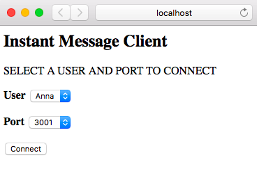
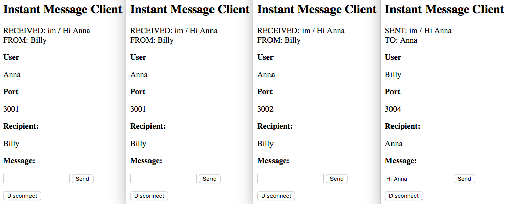
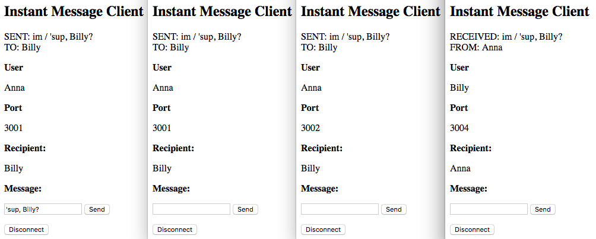
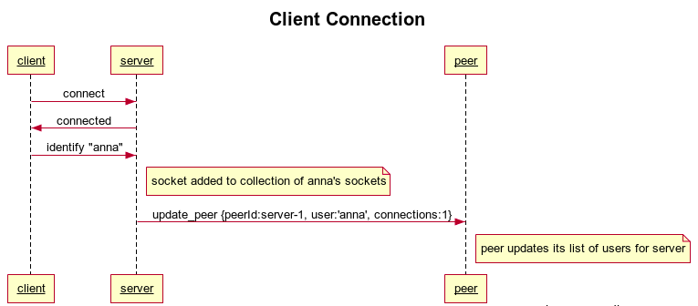
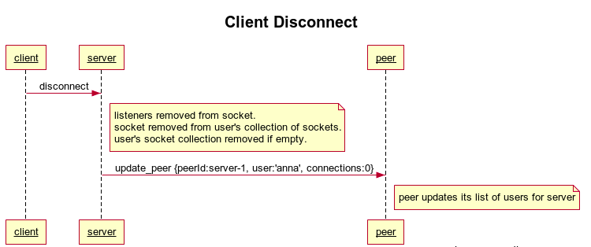
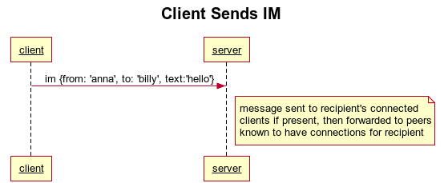
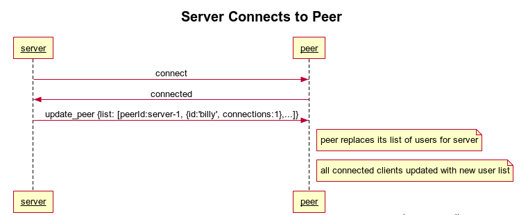
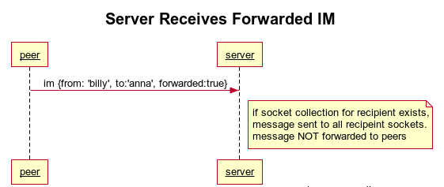

# node-multi-server-chat

## What is this?
A robust multi-server chat example built with Node and Socket.io

Simple Node-based chat server examples abound on GitHub. Single-endpoint examples 
are great for learning the basics of socket communications with Node, 
but there's only so much traffic one server can handle. In short, it won't scale. 

## Mesh Topology
With this server, any number of instances can be launched on different IP/Port combinations
and they will establish and maintain connections to each other.

After a server instance connects to a peer, it sends a list of its users and the number of connections
that user currently has open. Subsequently, when users connect and disconnect, the server instance
updates all its peers about that user's connection status.

Because every server instance always knows which users are connected to each of its peers, 
no database is required, a common bottleneck with Star Topology systems.
 
And since only a user's name and connection count is stored per connection, a 100k users with an average name 
length of nine characters and one connection would take up less than 1MB of memory. Clients are charged with 
accumulating their own message histories.

### Routing messages to recipients
When a server instance receives a message for a user it doesn't know, it will forward that message to 
any peers known to have a connection to that user.

Since the intended recipient could be connected to multiple server instances with separate clients, 
the message will also be forwarded to any peers known to have a connection to the recipient.

### Keeping the sender's clients in sync
The sender's message must also be sent to all their connections on all servers so that their
message histories will be able to reflect the complete discussion.

### Updating clients with the user list
Whenever a user connects to (or disconnects from) a server instance, all users connected to the mesh
will be sent a sorted, unique list of currently connected users.

## Setup

### Install Node and npm
[Node](https://nodejs.org/en/download/) 7.7 or above (also installs npm)

### Install Node modules
```cd path/to/node-multi-server-chat``` (the rest of this document assumes you are at this location)

```npm install```

### Launching Socket Server Instances
For convenience, several npm scripts have been defined in ```package.json``` for launching the socket server instances.

#### Inside your IDE
If you're running a modern IDE like Webstorm, you can just open the npm window and double-click on each ```start-server-x``` script. 
A separate integrated terminal will launch and you can monitor each instance's log output.

#### From the command line
In each of four separate terminal windows, enter one of the following commands: 

```npm run start-server-1```

```npm run start-server-2```

```npm run start-server-3```

```npm run start-server-4```

### Launching the Chat Client Server
A simple Express server has been included to serve the chat client, as well as an npm script to launch it.

```npm run serve-client```

## Design Assumptions
  * A client should be able to connect to any running instance and chat with a user on any other instance as though they were connected to the same instance.
  * The mechanism for connecting a user to a given instance is immaterial. It could be that the client chooses a random instance from a known list, or is assigned one by a load-balancer.
  * A given user could be connected with multiple clients, and so when a message is sent to them, all the user's clients should receive the message.  
  
## Server Configuration
A configuration file ```config.json``` contains entries for all instances, so they can listen on the right port and connect to their peers.
For simplicity's sake, server instances are configured to be launched on different ports of your local machine, 
but instances to run on any port / IP address:

    {
      "id": "server-1",
      "ip": "127.0.0.1",
      "port": 3001
    },

## Server Behavior
### Peer connections

When a server instance is launched, it begins listening on its assigned port and then attempts connection to its peers.
If a peer cannot be reached at launch time, instances will continue to retry until it becomes available.
If a connected peer disconnects at runtime, other instances will attempt to reconnect until it appears again. 
  
  
    Loading config from: config.json
    Config loaded.
    My id: server-1
    Listening for connections on port:3001
    Attempting to connect to peers...
    Attempt connection to peer: server-2 at: http://127.0.0.1:3002
    Attempt connection to peer: server-3 at: http://127.0.0.1:3003
    Attempt connection to peer: server-4 at: http://127.0.0.1:3004
    Outbound connection to peer: server-2
    Outbound connection to peer: server-3
    Outbound connection to peer: server-4

When a server instance receives an update from a peer at connection time, it is a list of all users connected to
that peer. It then updates all its connected clients with the new user list.

    Received update from peer: server-3
    Replacing user list for peer: server-3
    Updating clients with new user list...


When a server instance receives an update from a peer about an individual user's connection status, it amends its
internal list of users. It then updates all its connected clients with the new user list.

    Received update from peer: server-1
    Replacing user Anna in list for peer: server-1
    Updating clients with new user list...

    Received update from peer: server-3
    Adding user Billy to list for peer: server-3
    Updating clients with new user list...

    Received update from peer: server-2
    Removing user Anna from list for peer: server-2
    Updating clients with new user list...


### Client connections
When a client connects to an instance, it sends the user's name, and the server hangs onto the socket, associating it with that user.
Remember that a user can connect multiple times, so a collection of sockets is kept for each user. Also, when a user connects, the 
server instance updates all its peers with the connection status of that user and then updates all its connected clients with the 
new aggregate user list.

    User: Anna connected 1 time.
    Updating peers with connection count for user: Anna...
    Updating clients with new user list...
    User: Anna connected 2 times.
    Updating peers with connection count for user: Anna...
    Updating clients with new user list...


When a client sends a message to a user who is not on the same server instance they are connected to, the message is forwarded any peers known to have a connection to that user.

    User: Billy connected 1 times.
    Received IM from Billy to Anna: Hi Anna
    Recipient Anna not on this server
    Forwarding to peer: server-1 ...
    Forwarding to peer: server-2 ...

When a server instance receives a forwarded message from a peer for a user that has one or more connections, it sends the message
to all of the user's connected clients. It does not forward a forwarded message.

    Received forwarded IM from Billy to Anna: Hi Anna
    Recipient Anna has 2 connection(s) to this server, sending...


## Client Behavior
The rudimentary client has a dropdown with two predefined users (Anna and Billy), 
another dropdown with four possible ports to connect to, and a 'Connect' button.

The following features are out of scope for this simple client, but have been added to a more sophisticated 
[React-based client](https://github.com/cliffhall/react-chat-client).

  * Client-side message history. 
  * Client-side connected user list. This client simply logs the user list to the console when it is received. 
  

### Unconnected client


Choose a user and port then click 'Connect'. The recipient of your messages will be the user you didn't choose. 
Launch another browser and log in as the other user, choosing either the same or a different port. Send messages
back and forth. 

### User with multiple connections receives IM in all clients


### User with multiple connections sends IM, is notified in all clients so message histories can stay in sync



## Protocol










 


## TODO 

  * Add shell that opens multiple clients in iframes for testing. (Thanks to Kyle at Oasis Digital for this suggestion)
  
  * Add cluster module support, so a single port will do on a machine, while guaranteeing optimal use of CPUs.
 